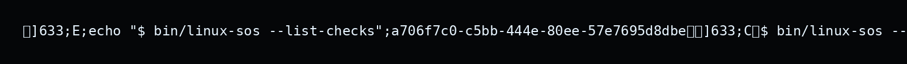
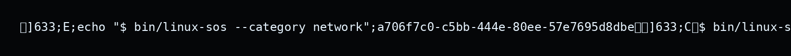
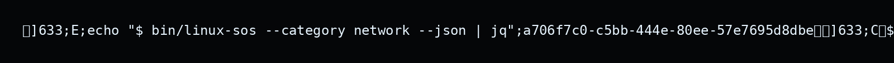

# Linux SOS


> Diagnósticos rápidos (e opcionais) para as dores mais comuns logo depois de instalar uma distro Linux.

É útil principalmente para:
- Quem acabou de instalar uma distro e quer validar rede, áudio, vídeo e sistema em minutos.
- Pessoas dando suporte/ajuda remota que precisam de um diagnóstico padronizado antes do debug manual.
- Ferramentas que desejam consumir diagnósticos via `--json` para automação ou coleta em massa.

Linux SOS é um CLI em Bash inspirado no "Windows Diagnostics" que oferece checks declarativos, correções seguras e packs por família de distro. O foco é padronizar o core e permitir que cada comunidade mantenha seus próprios módulos sem quebrar outras distros.

## Destaques

- **Core estável em Bash:** detecta a distro, regula a ordem de carregamento dos módulos (`common → família → ID`) e expõe uma mini DSL para checks/fixes.
- **Checks declarativos e seguros:** inspeções são read-only por padrão; fixes são opcionais, sempre confirmados (ou controlados por `--apply --yes`).
- **Saída unificada:** modo humano amigável ou `--json` para integração com outras ferramentas.
- **Packs por categoria/distro:** qualquer pessoa pode criar `modules/<categoria>/<family>.sh` e sobrescrever apenas o necessário.
- **Empacotamento simples:** `scripts/package.sh` gera tarballs para o core e para cada pack por distro/família.

## Estrutura do repositório

```
linux-diagnostics/
├── bin/
│   └── linux-sos              # CLI principal
├── core/
│   └── engine.sh              # Engine + mini DSL
├── modules/
│   ├── audio/
│   │   ├── common.sh
│   │   ├── arch.sh
│   │   ├── debian.sh
│   │   ├── fedora.sh
│   │   ├── manjaro.sh
│   │   ├── rpm.sh
│   │   └── ubuntu.sh
│   ├── network/
│   │   ├── common.sh
│   │   ├── arch.sh
│   │   ├── debian.sh
│   │   ├── fedora.sh
│   │   ├── manjaro.sh
│   │   ├── rpm.sh
│   │   └── ubuntu.sh
│   ├── system/
│   │   ├── common.sh
│   │   ├── arch.sh
│   │   ├── debian.sh
│   │   ├── fedora.sh
│   │   ├── manjaro.sh
│   │   ├── rpm.sh
│   │   └── ubuntu.sh
│   └── video/
│       ├── common.sh
│       ├── arch.sh
│       ├── debian.sh
│       ├── fedora.sh
│       ├── manjaro.sh
│       ├── rpm.sh
│       └── ubuntu.sh
├── scripts/
│   └── package.sh             # Empacotador oficial
├── VERSION
├── LICENSE
└── README.md
```

## Como o core funciona

1. **Detecção da distro** via `/etc/os-release` expõe `LINUX_SOS_DISTRO_FAMILY` (debian, arch, rpm, generic) e `LINUX_SOS_DISTRO_ID` (ubuntu, fedora, manjaro...).
2. **Carregamento de módulos** sempre em três camadas por categoria: `common.sh` → `<family>.sh` → `<id>.sh` (quando existir).
3. **Registro declarativo:** `sos_check` e `sos_fix` guardam categoria, prioridade, mensagens de falha/warn, sugestões, probabilidade e fix associado.
4. **Execução segura:** checks são read-only; fixes só rodam se o check falhar/alertar e se `--apply` estiver ativo (com confirmação adicional, salvo `--yes`).
5. **Saída padronizada:** cada check retorna `{status: ok|warn|fail, probabilidade, mensagem, sugestões}`. O modo `--json` entrega um array simples.

## Mini DSL (check + fix)

```bash
sos_fix "set_dns_cloudflare" <<'EOF'
description: Ajusta DNS para servidores Cloudflare (demonstração)
exec: printf '%s\n%s\n%s\n' \
  "Use 'nmcli connection modify <conexao> ipv4.dns \"1.1.1.1 1.0.0.1\"'" \
  "Após ajustar, aplique 'nmcli connection up <conexao>' para recarregar." \
  "Este fix é apenas um guia seguro; personalize antes de aplicar."
EOF

sos_check "dns_resolve" <<'EOF'
category: network
priority: high
description: "Testa resolução de DNS para cloudflare.com"
exec: getent hosts cloudflare.com
expect_nonempty: true
fail_message: DNS não está resolvendo nomes.
probability: alta
suggestions:
  - Teste ping 1.1.1.1; se funcionar, problema é DNS.
  - Edite /etc/resolv.conf ou configure DNS via NetworkManager.
fix: set_dns_cloudflare
EOF
```

Campos suportados em `sos_check`:

| Campo              | Descrição                                                     |
|--------------------|---------------------------------------------------------------|
| `category`         | network, audio, video, system, etc.                           |
| `priority`         | high, medium, low (impacta ordenação e destaque na saída).     |
| `exec`             | Comando a ser rodado. Pode usar `bash -c '...'`.               |
| `expect_exit_code` | Default `0`. Outros valores tratam falhas controladas.         |
| `expect_nonempty`  | `true`/`false` (literais): exige saída não vazia.              |
| `fail_message`     | Mensagem amigável quando algo falha.                           |
| `warn_message`     | Texto usado quando o check não possui saída, mas não é erro.   |
| `probability`      | `baixa`, `media` ou `alta` (sem acento).                       |
| `suggestions`      | Lista `- item` (uma por linha).                                |
| `fix`              | ID do fix associado (opcional).                                |

Fixes podem reutilizar o mesmo `id` em cada pack, mantendo fallback automático para `common`.

## Módulos inclusos

| Categoria | Checks principais (common)                                         | Packs (exemplos)                                                                  |
|-----------|--------------------------------------------------------------------|-----------------------------------------------------------------------------------|
| network   | `dns_resolve`, `gateway_ping`                                      | `netplan_renderer_conflict` (debian/ubuntu), `netctl_profiles_down` (arch/manjaro), `nm_cli_connections` (rpm/fedora) |
| audio     | `audio_server_running`, `default_sink_has_output`                  | `alsa_udev_permissions` (debian/ubuntu), `pipewire_packages` (arch/manjaro), `pipewire_services_enabled` (rpm/fedora) |
| video     | `display_resolution`, `gpu_acceleration`, `gpu_driver_detected`    | `prime_select_state` (debian/ubuntu), `mkinitcpio_nvidia_hook` (arch/manjaro), `secureboot_blocking_modules` (fedora/rpm) |
| system    | `root_partition_usage`, `log_disk_pressure`, `time_drift`          | `apt_autoremove_pending` (debian/ubuntu), `pacman_cache_size` (arch/manjaro), `dnf_history_pending` (rpm/fedora)       |

Crie novos checks/fixes em `common.sh` quando forem realmente universais. Para comportamentos específicos, abra `modules/<categoria>/<family>.sh` ou até `modules/<categoria>/<id>.sh`.

## Instalação

Por enquanto, o fluxo recomendado é clonar o repositório e usar o script diretamente:

```bash
git clone https://github.com/ruidosujeira/linux-diagnostics.git
cd linux-diagnostics

# Opcional: gerar os artefatos oficiais
scripts/package.sh
tar -xvf dist/linux-sos-*.tar.gz
cd dist/linux-sos-*/
```

A partir daí, rode o CLI normalmente:

```bash
bin/linux-sos --list-checks
bin/linux-sos --category network --json
```

**Requisitos mínimos:**
- Bash 4+
- Ferramentas padrão de sistema (getent, ping, nmcli, lspci...)
- Usuário com permissão para executar os comandos de diagnóstico (root **não** é obrigatório para os checks)

**Instalação via pacote (planejado):** publicar `.deb`, `.rpm`, AUR e Flatpak está no roadmap. Packs em `dist/` já seguem o formato `linux-sos-pack-<target>.tar.gz` para facilitar o empacotamento.

## Uso

```bash
# Listar checks registrados
bin/linux-sos --list-checks

# Rodar tudo com saída humana
bin/linux-sos

# Focar em uma categoria com JSON
bin/linux-sos --category network --json

# Oferecer correções interativas (confirmação por check com fix disponível)
bin/linux-sos --apply

# Aplicar correções automaticamente após confirmação global
bin/linux-sos --apply --yes

# Rodar apenas um check e forçar JSON
bin/linux-sos --check dns_resolve --json
```

A CLI nunca executa correções automaticamente sem `--apply`. Mesmo com `--apply`, cada fix pede confirmação a menos que você use `--yes`.

### Exemplo de saída (modo humano)

```bash
$ bin/linux-sos --category network
[OK]   dns_resolve              - Testa resolução de DNS para cloudflare.com
[WARN] gateway_ping             - Gateway responde com latência alta (120ms)
[FAIL] netplan_renderer_conflict - Netplan e NetworkManager configurados ao mesmo tempo
       Sugestões:
         - Desative o renderer conflitante em /etc/netplan/*.yaml.
         - Rode 'netplan apply' após o ajuste.
         - Veja também: https://netplan.io/examples
```

### Exemplo de saída (JSON)

```bash
$ bin/linux-sos --category network --json | jq
[
  {
    "id": "dns_resolve",
    "category": "network",
    "status": "ok",
    "probability": "alta",
    "message": "DNS está resolvendo cloudflare.com corretamente",
    "suggestions": []
  },
  {
    "id": "netplan_renderer_conflict",
    "category": "network",
    "status": "fail",
    "message": "Netplan e NetworkManager configurados ao mesmo tempo",
    "suggestions": [
      "Desative o renderer conflitante em /etc/netplan/*.yaml",
      "Rode 'netplan apply' após o ajuste."
    ],
    "fix": "netplan_fix_renderer"
  }
]
```

### Demonstrações em GIF

| Ação | GIF |
|------|-----|
| Listar todos os checks registrados (`bin/linux-sos --list-checks`) |  |
| Rodar apenas a categoria de rede em modo humano (`bin/linux-sos --category network`) |  |
| Coletar os mesmos dados em JSON e filtrar com `jq` (`bin/linux-sos --category network --json \| jq`) |  |

## Packs e contribuições por distro

- **Famílias suportadas de fábrica:** `debian`, `arch`, `rpm` (com fallback `generic`). Packs específicos como `ubuntu`, `fedora` e `manjaro` herdaram dessas famílias.
- **Sobrescreva apenas o necessário:** registre um fix com o mesmo `id` para mudar comandos em uma família sem quebrar as demais.
- **IDs específicos:** se uma distro exigir comportamento muito diferente (ex.: `ubuntu`, `fedora`), crie `modules/<categoria>/<id>.sh`; o core carrega `common → family → id` automaticamente.
- **Boas práticas:** checks devem ser não-destrutivos; fixes sempre explicam o que farão antes de pedir confirmação.

### Criando um pack novo em 3 passos

1. **Escolha categoria e família**

   Ex.: `modules/network/debian.sh` para checks específicos de Debian/Ubuntu.

2. **Registre um fix (opcional)**

   ```bash
   sos_fix "netplan_fix_renderer" <<'EOF'
   description: Ajusta renderer do Netplan para usar NetworkManager
   exec: |
     echo "Edite /etc/netplan/*.yaml e defina 'renderer: NetworkManager'."
     echo "Depois, execute 'sudo netplan apply'."
   EOF
   ```

3. **Registre um check que use esse fix**

   ```bash
   sos_check "netplan_renderer_conflict" <<'EOF'
   category: network
   priority: medium
   description: "Detecta conflito entre Netplan e NetworkManager"
   exec: bash -c 'grep -q NetworkManager /etc/netplan/*.yaml 2>/dev/null'
   expect_exit_code: 0
   fail_message: "Netplan não está configurado para NetworkManager."
   probability: media
   fix: netplan_fix_renderer
   EOF
   ```

Abra um PR adicionando apenas os arquivos relevantes dentro de `modules/<categoria>/` e descreva como testar.

## Empacotamento

Defina a versão em `VERSION` e gere os pacotes oficiais:

```bash
scripts/package.sh
```

O script cria:
- `linux-sos-core-<versão>.tar.gz` (contém `bin/`, `core/`, `modules/*/common.sh`, `README.md`, `VERSION`)
- `linux-sos-pack-<target>-<versão>.tar.gz` para cada família/distro (`debian`, `arch`, `rpm`, `ubuntu`, `fedora`, `manjaro`)

Use o core como base e distribua apenas os packs necessários para cada comunidade.

## Roadmap sugerido

1. **Novos packs:** `modules/<categoria>/<id>.sh` para Ubuntu, Fedora, Manjaro e derivados menores.
2. **Mais categorias:** drivers proprietários (NVIDIA/AMD), periféricos (touchpad, bluetooth, sensores) e storage (NVMe, RAID).
3. **GIFs/examples:** gravar clipes demonstrando `--list-checks`, `--json` e `--apply` para o README.
4. **Integração CI/CD:** rodar `bin/linux-sos --list-checks` e `bash -n core/engine.sh modules/**` em cada PR.
5. **Empacotamento distribuído:** publicar `.deb`, `.rpm`, AUR e Flatpak usando os tarballs core + packs.

## Contribuindo

1. Faça um fork/branch.
2. Adicione checks seguros (somente leitura) e fixes opcionais.
3. Atualize `README.md`, `modules/**` e adicione exemplos claros.
4. Rode `bin/linux-sos --list-checks` e, se possível, `scripts/package.sh` antes de abrir PR.
5. Documente qualquer novo comportamento ou variável de ambiente.

Pull requests e discussões sobre novos packs são sempre bem-vindos.

## Decisões de design

- **Bash puro:** facilita empacotamento em qualquer distro sem dependências extras.
- **DSL declarativa via heredoc:** checks/fixes são blocos legíveis, próximos de YAML, e versionados facilmente.
- **Segurança primeiro:** checks são sempre read-only; fixes dão visibilidade total do que será feito antes de pedir confirmação.

## Licença

Distribuído sob a licença [MIT](LICENSE) — sinta-se à vontade para usar, modificar e distribuir, respeitando os termos.
